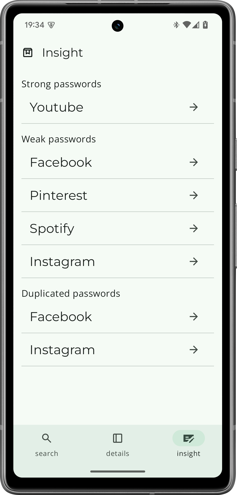

# My password manager
**`Android application`**

### App Features:
- Biometric or device credential authentication
- On-device password storing
- Password strength and duplication evaluation
- Autofill and Auto Save external applications' credentials

### Technology used:
- Kotlin: as a programming language
- Jetpack Compose: as the UI library
- Room DB: to store data locally
- Dagger Hilt: for dependency injection
- AutofillService: to manage autofill and auto-save functionality
- Flow for streaming the data
- BiometricManager: to authenticate users prior to accessing the app contents 

### Future features:
For the app to be ready to be used by a large public, it needs convenient features such as the ability to upload or download data, the ability to store more information such as payment details and addresses, and the ability to suggest strong passwords, etc.
